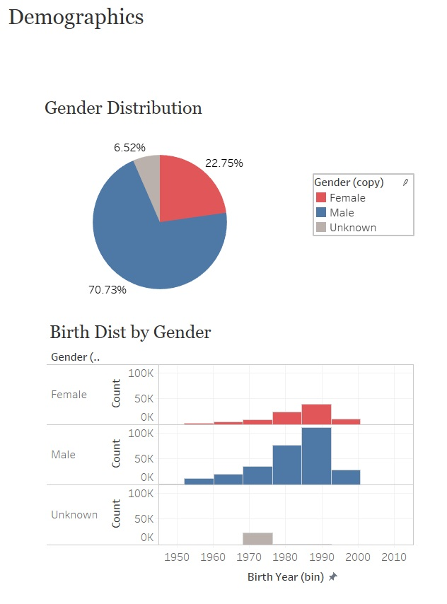
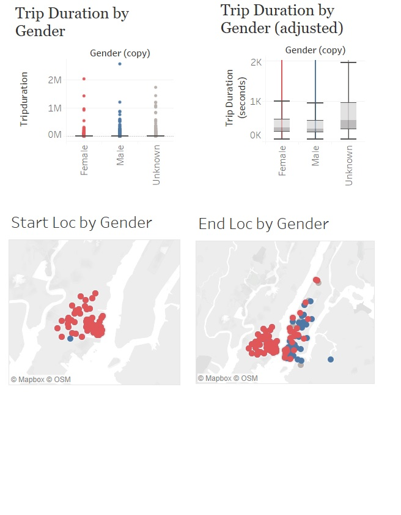

# Tableau Project - New York City Bike Program

## Background

Since 2013, the Citi Bike Program has implemented a robust infrastructure for collecting data on the program's utilization. Through the team's efforts, each month bike data is collected, organized, and made public on the [Citi Bike Data](https://www.citibikenyc.com/system-data) webpage.

According to The Gender Policy Report from the University of Minnesota, men are more likely to engage in urban cycling than females due to different safety concerns. Studies conducted in Minneapolis showed strong correlations between gender and encroachment: that is, vehicles passing riders less than 3 ft. away from distance.

## Objective

Find relationships or patterns in the data based on gender by using New Yor City, one of the largest metropolitan areas in the world, as reference to verify these findings

## Basic Demographics

The dataset from 2019 contains trip information including start and end location, duration, bike used, distance travelled, and rider gender. The dataset contains 404,947 records. Refer to the pie chart to the left for breakdown on gender distribution. Clearly, males use bike as mean of transportation more than women

However, this proportion alone is not good to explain the difference in participation. The data obtain shows an age breakdown that is remarkably similar for both genders considering the difference in population. It's worth noting that riders who did not report their gender are typically older than  half of the users. Notice the data is skewed meaning that most riders tend to be 45 years old or older regardless of gender.

## Trip Duration

For trip duration, there is not enough evidence to state that the trip duration varies significantly with gender. The non-adjusted data includes about between 600 to 700 entries which despite the large magnitude, only comprise less than 1% of the data. Again, users who did not report gender present the largest variation on trip duration, but still no evidence of significant difference.

Finally, start and ending trip locations present some interesting patterns. Male and female riders start travelling from the similar areas, but the destination for males spreads farther apart by comparison. It is unclear why this phenomenon occurs with the information available.  

## Preliminary Conclusions

There is not enough evidence to conclude than men are willing to participate in the bike program more so than women based on the data provided. Surveys could serve as a useful tool to complement this study. Since there is no significant difference in trip duration, it would be worthwhile to gather information related to the participant's routine/preferences. For example, female riders may prefer certain areas of the city depending on crime rate. A follow-up assignment would consist on preparing random surveys to gather information about the participant's experience. The data collection system is robust enough and resources should definitely be assign to maintain the program running for the city. 

### Copyright

Arturo Wilson (C) 2020. All Rights Reserved.
